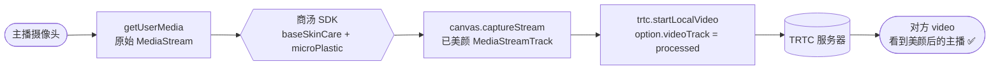
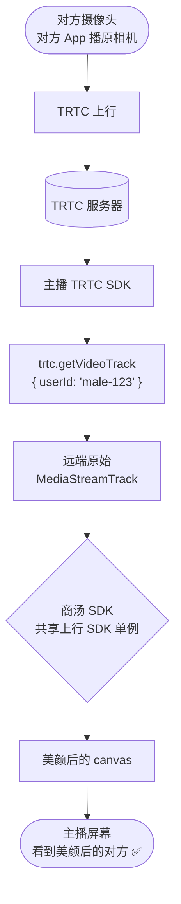

# 商汤美颜接入 sitin-next PWA · 实现指南

**目标分支**:`sitin-next feature/pwa`
**接入方**:`packages/app-pwa`
**SDK 封装包**:`@heyhru/web-plugin-sensetime-beauty`(新建 `packages/web-plugin-sensetime-beauty/`)
**配套可视化**:[implementation-guide-pwa.html](implementation-guide-pwa.html)(light 风格 HTML,含彩色 Mermaid 流程图 + 粒子动效,浏览器直接打开)
**上位方案**(含选型讨论):[tech-proposal-pwa-integration](tech-proposal-pwa-integration.md)

> 本文是**实现指南**,只写正确方案,不写方案选择。四件事:能力范围 · 本方美颜接入(上行) · 对方美颜接入(下行) · SDK 抽离为 package + PWA 完整接入代码。

---

## 0. 能力范围:只启用两项

商汤 `effects` SDK 内部子能力众多,本方案**只启用**两项,其余全部关闭以减小体积、聚焦核心、避免精度浪费。

### 启用

- **`baseSkinCare`(基础美颜)** — 磨皮 `skinSmooth` / 美白 `whiten` / 红润 `redden`,值域 0-1
- **`microPlastic`(微整形)** — 瘦脸 `faceSlim` / 大眼 `eyeEnlarge` / 下巴 `chin` / 额头 `forehead` / 鼻梁 `noseLift` / 嘴形 `mouthSize`,值域 0-1

### 关闭

`effects` 里的滤镜 / 贴纸 / 整妆 / 背景虚化,以及 `makeup` / `hair` / `nail` / `tryon` 四类 SDK 全部**不加载**。包体积只加载 `effects` 单包 ≈ 3-5 MB。

---

## 1. 本方美颜(上行):改上行 track,对方一定能看到

### 原理

通过替换 TRTC 上行的 `videoTrack`,把商汤 SDK 处理后的 canvas 流推给对端。对方看到的就是美颜后的画面。

### 数据流



### 关键 API

- TRTC v5 `startLocalVideo({ view, publish, option: { videoTrack } })` 接受**自定义** `MediaStreamTrack`(见 `trtc-sdk-v5/index.d.ts` 的 `LocalVideoConfig`)
- 热切换:`updateLocalVideo({ option: { videoTrack: newTrack } })`,无需 exit/enter room
- 底层 `_trtc` 实例:`this.engine.getTRTCCloudInstance()._trtc`(`webCallManager` 已暴露)

### 接入步骤

1. `webCallManager.startLocalVideo(viewId)` 里,先 `getUserMedia` 拿原始 stream(可复用 `useCameraStream` 单例)
2. 调用 package 的 `createBeauty(...).process(stream)`,拿到美颜后的 `MediaStreamTrack`
3. 用这个 track 调 `trtc.startLocalVideo({ view, publish: true, option: { videoTrack } })`。**跳过** TUICallEngine 的 `openCamera`(否则会覆盖)

---

## 2. 对方美颜(下行):能,对方无感知

### 结论

**能**。只在主播端本地处理"收到的对方视频",对方 App 播的仍是他自己的原相机,不知道也不需要知道。

### 技术依据(一手证据)

- **API**:`trtc.getVideoTrack({ userId })` 直接返回远端 `MediaStreamTrack`
- **证据文件**:`sitin-next/node_modules/trtc-sdk-v5/index.d.ts:2216`
- **SDK 版本**:`5.15.3-beta.9`(与 `app-pwa/package.json` 声明的 `^5.15.2` 一致)
- **官方注释原文**:*"If not passed or passed an empty string, get the local videoTrack. Pass the userId of the remote user to get the remote user's videoTrack."*

### 数据流



### 接入步骤

1. 远端上流触发 `REMOTE_VIDEO_AVAILABLE`,用 `trtc.getVideoTrack({ userId: remoteUserId })` 拿 `MediaStreamTrack`
2. 传给 package 的 `beauty.processRemote({ userId, track, preset })`,拿到渲染中的 `HTMLCanvasElement`
3. UI 里用这个 `canvas` 替换原本 SDK 挂的 `<video id="remote-video">`(`startRemoteVideo` 的 `view` 传 `null`,或隐藏 SDK 挂的元素)

对方端**不需要做任何改动**。

---

## 3. SDK 抽离为独立 package

### 3.1 命名与规范

| 项 | 值 |
|---|---|
| 包名 | `@heyhru/web-plugin-sensetime-beauty` |
| 位置 | `packages/web-plugin-sensetime-beauty/` |
| 命名规范依据 | `web-plugin-*` = 前端第三方库封装(需配置和生命周期)。参考 `web-plugin-codemirror`。见 `sitin-next/docs/coding-conventions.md` |
| 依赖方 | 现在:`@heyhru/app-pwa`。未来可复用给其他前端 app |
| **不**依赖 | 不 `import` TRTC / TUICallEngine —— 输入/输出用标准 W3C 类型,TRTC 集成留给调用方 |

### 3.2 目录结构

```
packages/web-plugin-sensetime-beauty/
├── package.json            # @heyhru/web-plugin-sensetime-beauty · CJS + ESM 双出口
├── tsconfig.json           # emitDeclarationOnly, rootDir: src, outDir: dist
├── tsup.config.ts          # format: [cjs, esm], dts: false, clean: true
├── README.md
└── src/
    ├── index.ts            # 公共 API 入口:createBeauty / 类型 / 预设
    ├── index.test.ts       # vitest 单元测试
    ├── types.ts            # BeautyParams / BeautyOptions / BeautyInstance
    ├── presets.ts          # OFF / LIGHT / NATURAL / STRONG 预设
    ├── capability.ts       # 环境探测(WebGL2 / captureStream / iOS 版本)
    ├── loader.ts           # st-ar-effects.js + wasm + data + WebAR.lic 动态加载
    ├── pipeline.ts         # video → SDK → canvas → captureStream 帧管线
    └── manager.ts          # SenseTimeBeautyManager 单例:process / processRemote / setParams / dispose
```

### 3.3 公共 API

| API | 说明 |
|---|---|
| `createBeauty(options)` | 创建/返回 SDK 单例(内部 memoized)。首次调用会加载 SDK 资源 |
| `beauty.process(source, opts?)` | 处理本地流:输入 `MediaStream`,输出美颜后的 `MediaStreamTrack`。用于上行 |
| `beauty.processRemote(opts)` | 处理远端 track:输入 `{userId, track, preset?}`,输出正在渲染的 `HTMLCanvasElement`。用于下行 |
| `beauty.setParams(params, ch?)` | 动态调节参数。`ch` 指定通道(`'local'` / `{userId}`),不传则改所有 |
| `beauty.stopRemote(userId)` | 停止某路远端处理,释放对应 pipeline |
| `beauty.dispose()` | 销毁 SDK 单例,释放 WebGL/WASM/canvas。通话结束时调 |
| `PRESETS` | 预设参数集合:`OFF / LIGHT / NATURAL / STRONG` |
| `isBeautySupported()` | 能力探测,不支持时降级到裸流(SDK 不加载) |

### 3.4 SDK 资源与 license

- SDK 静态资源(`st-ar-effects.js` / `.wasm` / `.data` / `WebAR.lic`)**不打进 npm 包**,由调用方 app 放到自己的 `public/sdk/effects/` 或 CDN
- package 只暴露 `sdkBaseUrl` / `licenseUrl` 参数,让调用方指定资源位置。这样测试/生产走各自 CDN,license 不跟着包分发
- 仅加载 `effects` 单包(不加载 makeup / hair / nail / tryon)

---

## 4. Package 核心实现

### 4.1 package.json

```json
{
  "name": "@heyhru/web-plugin-sensetime-beauty",
  "version": "0.1.0",
  "description": "SenseTime SenseMARS beauty (baseSkinCare + microPlastic) as MediaStreamTrack pipeline",
  "main": "dist/index.cjs",
  "module": "dist/index.js",
  "types": "dist/index.d.ts",
  "exports": {
    ".": {
      "import": "./dist/index.js",
      "require": "./dist/index.cjs",
      "types": "./dist/index.d.ts"
    }
  },
  "files": ["dist"],
  "scripts": {
    "build": "tsup && tsc --emitDeclarationOnly",
    "dev": "tsup --watch",
    "lint": "eslint src",
    "test": "vitest run",
    "clean": "rm -rf dist"
  },
  "devDependencies": {
    "tsup": "^8",
    "typescript": "^5",
    "vitest": "^2"
  }
}
```

### 4.2 src/types.ts

```ts
/** 美颜参数,所有值 0-1,0 = 关闭 */
export interface BeautyParams {
  // baseSkinCare
  skinSmooth?: number;
  whiten?: number;
  redden?: number;
  // microPlastic
  faceSlim?: number;
  eyeEnlarge?: number;
  chin?: number;
  forehead?: number;
  noseLift?: number;
  mouthSize?: number;
}

export interface BeautyOptions {
  /** SDK 静态资源目录,例:'/sdk/effects' */
  sdkBaseUrl: string;
  /** WebAR.lic 位置 */
  licenseUrl: string;
  /** 输出帧率,默认 24 */
  fps?: number;
  /** 初始参数,默认 PRESETS.NATURAL */
  initialParams?: BeautyParams;
}

export interface ProcessLocalOptions { preset?: BeautyParams; }

export interface ProcessRemoteOptions {
  userId: string;
  track: MediaStreamTrack;
  preset?: BeautyParams;
}

export type BeautyChannel = 'local' | { userId: string };

export interface BeautyInstance {
  process(source: MediaStream, opts?: ProcessLocalOptions): Promise<MediaStreamTrack>;
  processRemote(opts: ProcessRemoteOptions): Promise<HTMLCanvasElement>;
  setParams(params: BeautyParams, channel?: BeautyChannel): void;
  stopRemote(userId: string): void;
  dispose(): void;
}
```

### 4.3 src/presets.ts

```ts
import type { BeautyParams } from './types';

export const PRESETS: Record<'OFF' | 'LIGHT' | 'NATURAL' | 'STRONG', BeautyParams> = {
  OFF: {},
  LIGHT:   { skinSmooth: 0.3, whiten: 0.2, redden: 0.1 },
  NATURAL: { skinSmooth: 0.5, whiten: 0.35, redden: 0.15,
             faceSlim: 0.25, eyeEnlarge: 0.2, chin: 0.15 },
  STRONG:  { skinSmooth: 0.75, whiten: 0.55, redden: 0.25,
             faceSlim: 0.45, eyeEnlarge: 0.4, chin: 0.3, noseLift: 0.2 },
};
```

### 4.4 src/capability.ts

```ts
export function isBeautySupported(): boolean {
  if (typeof window === 'undefined') return false;
  // 1. WebGL2
  const gl = document.createElement('canvas').getContext('webgl2');
  if (!gl) return false;
  // 2. HTMLCanvasElement.captureStream (iOS 15.4+ / Chrome 51+)
  if (typeof HTMLCanvasElement.prototype.captureStream !== 'function') return false;
  // 3. WASM
  if (typeof WebAssembly === 'undefined') return false;
  return true;
}
```

### 4.5 src/loader.ts

```ts
/**
 * 动态加载商汤 SDK 资源。只加载 effects,不碰 makeup/hair/nail/tryon。
 * 参考 shangtang-sdk-demo 的 st-ar-effects.js 加载协议。
 */
let loaded: Promise<SenseTimeSDK> | null = null;

export function loadSdk(sdkBaseUrl: string, licenseUrl: string): Promise<SenseTimeSDK> {
  if (loaded) return loaded;
  loaded = (async () => {
    await injectScript(`${sdkBaseUrl}/st-ar-effects.js`);
    const license = await fetch(licenseUrl).then(r => r.arrayBuffer());
    const sdk = await (window as any).STAR.create({
      sdkPath: sdkBaseUrl,
      license,
      modules: ['baseSkinCare', 'microPlastic'],  // 只启用这两个
    });
    return sdk;
  })();
  return loaded;
}

function injectScript(src: string): Promise<void> {
  return new Promise((res, rej) => {
    const s = document.createElement('script');
    s.src = src; s.async = true;
    s.onload = () => res();
    s.onerror = () => rej(new Error(`load ${src} failed`));
    document.head.appendChild(s);
  });
}
```

### 4.6 src/pipeline.ts

```ts
/**
 * 单路视频帧管线:MediaStreamTrack → <video> → SDK.render(canvas) → captureStream
 * 本地 / 每路 remote 各自一个管线实例
 */
export class BeautyPipeline {
  private video: HTMLVideoElement;
  private canvas: HTMLCanvasElement;
  private outStream: MediaStream | null = null;
  private raf = 0;
  private stopped = false;

  constructor(private sdk: SenseTimeSDK, private fps: number) {
    this.video = document.createElement('video');
    this.video.muted = true;
    this.video.playsInline = true;
    this.canvas = document.createElement('canvas');
  }

  async start(source: MediaStream | MediaStreamTrack): Promise<void> {
    const stream = source instanceof MediaStream
      ? source
      : new MediaStream([source]);
    this.video.srcObject = stream;
    await this.video.play();
    this.canvas.width  = this.video.videoWidth;
    this.canvas.height = this.video.videoHeight;
    this.outStream = this.canvas.captureStream(this.fps);
    this.loop();
  }

  private loop = () => {
    if (this.stopped) return;
    this.sdk.render(this.video, this.canvas);
    this.raf = requestAnimationFrame(this.loop);
  };

  setParams(params: BeautyParams): void {
    for (const [k, v] of Object.entries(params)) {
      this.sdk.updateParam(k, v);
    }
  }

  get track(): MediaStreamTrack {
    return this.outStream!.getVideoTracks()[0];
  }
  get canvasEl(): HTMLCanvasElement { return this.canvas; }

  dispose(): void {
    this.stopped = true;
    cancelAnimationFrame(this.raf);
    this.video.pause();
    this.video.srcObject = null;
    this.outStream?.getTracks().forEach(t => t.stop());
  }
}
```

### 4.7 src/manager.ts

```ts
import { loadSdk } from './loader';
import { BeautyPipeline } from './pipeline';
import { PRESETS } from './presets';
import type { BeautyOptions, BeautyInstance, BeautyParams,
              ProcessLocalOptions, ProcessRemoteOptions,
              BeautyChannel } from './types';

let singleton: SenseTimeBeautyManager | null = null;

export function createBeauty(options: BeautyOptions): BeautyInstance {
  if (!singleton) singleton = new SenseTimeBeautyManager(options);
  return singleton;
}

class SenseTimeBeautyManager implements BeautyInstance {
  private local: BeautyPipeline | null = null;
  private remotes = new Map<string, BeautyPipeline>();
  private currentParams: BeautyParams;

  constructor(private opts: BeautyOptions) {
    this.currentParams = opts.initialParams ?? PRESETS.NATURAL;
  }

  async process(source: MediaStream, opts?: ProcessLocalOptions): Promise<MediaStreamTrack> {
    const sdk = await loadSdk(this.opts.sdkBaseUrl, this.opts.licenseUrl);
    this.local?.dispose();
    this.local = new BeautyPipeline(sdk, this.opts.fps ?? 24);
    await this.local.start(source);
    this.local.setParams(opts?.preset ?? this.currentParams);
    return this.local.track;
  }

  async processRemote(opts: ProcessRemoteOptions): Promise<HTMLCanvasElement> {
    const sdk = await loadSdk(this.opts.sdkBaseUrl, this.opts.licenseUrl);
    this.remotes.get(opts.userId)?.dispose();
    const p = new BeautyPipeline(sdk, this.opts.fps ?? 24);
    await p.start(opts.track);
    p.setParams(opts.preset ?? this.currentParams);
    this.remotes.set(opts.userId, p);
    return p.canvasEl;
  }

  setParams(params: BeautyParams, channel?: BeautyChannel): void {
    this.currentParams = { ...this.currentParams, ...params };
    if (!channel) {
      this.local?.setParams(params);
      this.remotes.forEach(p => p.setParams(params));
    } else if (channel === 'local') {
      this.local?.setParams(params);
    } else {
      this.remotes.get(channel.userId)?.setParams(params);
    }
  }

  stopRemote(userId: string): void {
    this.remotes.get(userId)?.dispose();
    this.remotes.delete(userId);
  }

  dispose(): void {
    this.local?.dispose();
    this.remotes.forEach(p => p.dispose());
    this.remotes.clear();
    singleton = null;
  }
}
```

### 4.8 src/index.ts

```ts
export { createBeauty } from './manager';
export { PRESETS } from './presets';
export { isBeautySupported } from './capability';
export type {
  BeautyParams,
  BeautyOptions,
  BeautyInstance,
  BeautyChannel,
  ProcessLocalOptions,
  ProcessRemoteOptions,
} from './types';
```

---

## 5. PWA 接入实现

7 个改动点(可直接映射为 PR diff)。

### 5.1 依赖 + Vite 配置 + SDK 资源

**① 加 workspace 依赖**(`packages/app-pwa/package.json`):

```json
{
  "dependencies": {
    "@heyhru/web-plugin-sensetime-beauty": "workspace:*"
  }
}
```

**② 放置 SDK 静态资源**(`packages/app-pwa/public/sdk/effects/`):

```
st-ar-effects.js       # 商汤 effects SDK 加载器
st-ar-effects.wasm     # WASM 核心 (~2-3MB)
st-ar-effects.data     # 模型数据
WebAR.lic              # License(dev 本地,prod 走 OSS)
```

**③ Vite + Workbox 配置**:SDK 资源不进 precache,懒加载 + CacheFirst 长期缓存。

```ts
// packages/app-pwa/vite.config.ts
import { defineConfig } from 'vite';
import { VitePWA } from 'vite-plugin-pwa';

export default defineConfig({
  plugins: [
    VitePWA({
      workbox: {
        globPatterns: ['**/*.{js,css,html,ico,png,svg}'],
        globIgnores:  ['**/sdk/**/*.{wasm,data,js}'],  // SDK 不进 precache
        runtimeCaching: [{
          urlPattern: /^.*\/sdk\/effects\/.*\.(wasm|data|js)$/,
          handler: 'CacheFirst',
          options: {
            cacheName: 'sensetime-effects',
            expiration: { maxAgeSeconds: 60 * 60 * 24 * 30 },
          },
        }],
      },
    }),
  ],
});
```

### 5.2 App 侧统一入口 · `services/beautyClient.ts`

把 `sdkBaseUrl` / `licenseUrl` 收敛到一个文件,避免 UI 组件里到处写 URL。

```ts
// packages/app-pwa/src/services/beautyClient.ts
import {
  createBeauty, PRESETS, isBeautySupported,
  type BeautyInstance,
} from '@heyhru/web-plugin-sensetime-beauty';

let instance: BeautyInstance | null = null;

export function getBeauty(): BeautyInstance {
  if (instance) return instance;
  instance = createBeauty({
    sdkBaseUrl: '/sdk/effects',
    licenseUrl: '/sdk/effects/WebAR.lic',
    initialParams: PRESETS.NATURAL,
    fps: 24,
  });
  return instance;
}

export function disposeBeauty(): void {
  instance?.dispose();
  instance = null;
}

export { PRESETS, isBeautySupported };
```

### 5.3 Zustand store · `store/beautyStore.ts`

美颜参数放 store,面板 UI 订阅、通话链路读取(判断是否启用),两处解耦。

```ts
// packages/app-pwa/src/store/beautyStore.ts
import { create } from 'zustand';
import { PRESETS, type BeautyParams } from '@heyhru/web-plugin-sensetime-beauty';
import { getBeauty } from '@/services/beautyClient';

type PresetKey = keyof typeof PRESETS;

interface BeautyState {
  enabled: boolean;
  preset: PresetKey | 'CUSTOM';
  params: BeautyParams;
  setEnabled(v: boolean): void;
  applyPreset(key: PresetKey): void;
  updateParam(key: keyof BeautyParams, value: number): void;
}

export const useBeautyStore = create<BeautyState>((set, get) => ({
  enabled: true,
  preset: 'NATURAL',
  params: PRESETS.NATURAL,
  setEnabled(v) { set({ enabled: v }); },
  applyPreset(key) {
    const params = PRESETS[key];
    set({ preset: key, params });
    getBeauty().setParams(params, 'local');
  },
  updateParam(key, value) {
    const params = { ...get().params, [key]: value };
    set({ preset: 'CUSTOM', params });
    getBeauty().setParams({ [key]: value }, 'local');
  },
}));
```

### 5.4 上行接入 · `webCallManager.startLocalVideo` 改造

关键改动:**绕开 `TUICallEngine.openCamera`**(它会盖掉自定义 `videoTrack`),自建 `getUserMedia` → 美颜 → `trtc.startLocalVideo`。前后置切换走 `updateLocalVideo` 热切换。

```ts
// packages/app-pwa/src/services/webCallManager.tsx (改造后)
import { getBeauty, isBeautySupported } from '@/services/beautyClient';
import { useBeautyStore } from '@/store/beautyStore';

private shouldUseBeauty(): boolean {
  return isBeautySupported() && useBeautyStore.getState().enabled;
}

async startLocalVideo(viewId: string): Promise<void> {
  // ① 拿原始摄像头流(复用 useCameraStream 单例)
  const stream = await this.cameraSource.acquire();

  // ② 走 SDK 或裸流(降级)
  const videoTrack = this.shouldUseBeauty()
    ? await getBeauty().process(stream)
    : stream.getVideoTracks()[0];

  // ③ 塞给 TRTC 上行(跳过 TUICallEngine.openCamera)
  await this.trtc.startLocalVideo({
    view: viewId,
    publish: true,
    option: { videoTrack, profile: '480p_1', mirror: true },
  });
}

async switchCamera(facing: 'user' | 'environment'): Promise<void> {
  await this.cameraSource.switch(facing);
  const stream = await this.cameraSource.acquire();
  const track  = this.shouldUseBeauty()
    ? await getBeauty().process(stream)
    : stream.getVideoTracks()[0];
  // 热切换,不用 exit/enter room
  await this.trtc.updateLocalVideo({ option: { videoTrack: track } });
}

async setBeautyEnabled(on: boolean): Promise<void> {
  useBeautyStore.getState().setEnabled(on);
  const stream = await this.cameraSource.acquire();
  const track  = on && isBeautySupported()
    ? await getBeauty().process(stream)
    : stream.getVideoTracks()[0];
  await this.trtc.updateLocalVideo({ option: { videoTrack: track } });
}
```

### 5.5 下行接入 · `REMOTE_VIDEO_AVAILABLE` 事件

接完事件后拿 remote track → 走 `processRemote` → 拿到 canvas → 通过 eventBus 传给 React 侧挂载。

```ts
// packages/app-pwa/src/services/webCallManager.tsx (下行部分)
import { PRESETS } from '@/services/beautyClient';
import { eventBus } from '@/utils/eventBus';

private subscribeRemote(): void {
  this.trtc.on(TRTC.EVENT.REMOTE_VIDEO_AVAILABLE, async ({ userId, streamType }) => {
    if (streamType !== TRTC.TYPE.STREAM_TYPE_MAIN) return;

    const remoteTrack = this.trtc.getVideoTrack({ userId, streamType });
    if (!remoteTrack) return;

    if (!this.shouldUseBeauty()) {
      // 降级:走 SDK 自动挂 <video>
      await this.trtc.startRemoteVideo({ userId, view: `remote-${userId}` });
      return;
    }

    const canvas = await getBeauty().processRemote({
      userId,
      track: remoteTrack,
      preset: PRESETS.LIGHT,          // 对方档位比本方轻一档
    });
    eventBus.emit('beauty:remoteReady', { userId, canvas });
  });

  this.trtc.on(TRTC.EVENT.REMOTE_USER_EXIT, ({ userId }) => {
    getBeauty().stopRemote(userId);
    eventBus.emit('beauty:remoteRemoved', { userId });
  });
}
```

React 组件把 canvas 挂进 DOM:

```tsx
// packages/app-pwa/src/components/RemoteVideoView.tsx
import { useEffect, useRef } from 'react';
import { eventBus } from '@/utils/eventBus';

interface Props { userId: string; className?: string; }

export function RemoteVideoView({ userId, className }: Props) {
  const hostRef = useRef<HTMLDivElement>(null);

  useEffect(() => {
    const onReady = (p: { userId: string; canvas: HTMLCanvasElement }) => {
      if (p.userId !== userId || !hostRef.current) return;
      Object.assign(p.canvas.style, {
        width: '100%', height: '100%',
        objectFit: 'cover', display: 'block',
      });
      hostRef.current.replaceChildren(p.canvas);
    };
    const onRemoved = (p: { userId: string }) => {
      if (p.userId !== userId || !hostRef.current) return;
      hostRef.current.replaceChildren();
    };
    eventBus.on('beauty:remoteReady',  onReady);
    eventBus.on('beauty:remoteRemoved', onRemoved);
    return () => {
      eventBus.off('beauty:remoteReady',  onReady);
      eventBus.off('beauty:remoteRemoved', onRemoved);
    };
  }, [userId]);

  return <div ref={hostRef} className={className} />;
}
```

### 5.6 美颜面板 · `components/BeautyPanel.tsx`

4 档预设 + 3 项基础美颜(磨皮/美白/红润)+ 3 项微整形(瘦脸/大眼/下巴)滑块。Store 单向数据流,组件只订阅。

```tsx
// packages/app-pwa/src/components/BeautyPanel.tsx
import { useBeautyStore } from '@/store/beautyStore';
import type { BeautyParams } from '@heyhru/web-plugin-sensetime-beauty';

const PRESETS_UI = [
  { key: 'OFF',     label: '关闭' },
  { key: 'LIGHT',   label: '轻' },
  { key: 'NATURAL', label: '自然' },
  { key: 'STRONG',  label: '浓' },
] as const;

const PARAMS_UI: Array<{
  key: keyof BeautyParams;
  label: string;
  group: 'skin' | 'shape';
}> = [
  { key: 'skinSmooth', label: '磨皮', group: 'skin' },
  { key: 'whiten',     label: '美白', group: 'skin' },
  { key: 'redden',     label: '红润', group: 'skin' },
  { key: 'faceSlim',   label: '瘦脸', group: 'shape' },
  { key: 'eyeEnlarge', label: '大眼', group: 'shape' },
  { key: 'chin',       label: '下巴', group: 'shape' },
];

export function BeautyPanel() {
  const { enabled, preset, params, setEnabled, applyPreset, updateParam }
    = useBeautyStore();

  return (
    <div className="beauty-panel">
      <label className="beauty-switch">
        <input type="checkbox" checked={enabled}
               onChange={e => setEnabled(e.target.checked)} />
        美颜
      </label>

      <div className="beauty-presets">
        {PRESETS_UI.map(p => (
          <button key={p.key} disabled={!enabled}
                  className={preset === p.key ? 'is-active' : ''}
                  onClick={() => applyPreset(p.key)}>
            {p.label}
          </button>
        ))}
      </div>

      {(['skin', 'shape'] as const).map(g => (
        <section key={g} className="beauty-group">
          <h4>{g === 'skin' ? '基础美颜' : '微整形'}</h4>
          {PARAMS_UI.filter(p => p.group === g).map(p => (
            <label key={p.key} className="beauty-slider">
              <span>{p.label}</span>
              <input type="range" min={0} max={1} step={0.05}
                     value={params[p.key] ?? 0}
                     disabled={!enabled}
                     onChange={e => updateParam(p.key, +e.target.value)} />
              <span className="beauty-value">
                {((params[p.key] ?? 0) * 100).toFixed(0)}
              </span>
            </label>
          ))}
        </section>
      ))}
    </div>
  );
}
```

### 5.7 通话生命周期清理

SDK 持有 WebGL context + WASM 内存,通话结束必须 `dispose`,否则拨新通话会累积泄漏。

```ts
// packages/app-pwa/src/services/webCallManager.tsx (清理部分)
import { disposeBeauty } from '@/services/beautyClient';

async hangup(): Promise<void> {
  await this.trtc.stopLocalVideo();
  await this.trtc.exitRoom();
  this.cameraSource.release();
  disposeBeauty();   // 释放 WebGL + WASM,避免拨新通话时累积泄漏
}

private handleCallEnd(): void {
  // 对端挂断 / 网络断开 / 服务器踢人:同样清理
  disposeBeauty();
}
```

页面 unmount 兜底:

```tsx
// packages/app-pwa/src/pages/CallPage.tsx
import { useEffect } from 'react';
import { disposeBeauty } from '@/services/beautyClient';

export function CallPage() {
  useEffect(() => () => { disposeBeauty(); }, []);
  // ...
}
```

### 5.8 改动清单

| 类型 | 文件 | 动作 |
|---|---|---|
| 依赖 | `packages/app-pwa/package.json` | `+ @heyhru/web-plugin-sensetime-beauty` |
| 资源 | `packages/app-pwa/public/sdk/effects/*` | 放置 4 个文件(js / wasm / data / lic) |
| 配置 | `packages/app-pwa/vite.config.ts` | Workbox precache 排除 + runtime CacheFirst |
| 新增 | `src/services/beautyClient.ts` | app 侧单例入口 |
| 新增 | `src/store/beautyStore.ts` | Zustand · 参数状态 |
| 改造 | `src/services/webCallManager.tsx` | `startLocalVideo` / `switchCamera` / `subscribeRemote` / `hangup` |
| 新增 | `src/components/RemoteVideoView.tsx` | canvas 挂载容器 |
| 新增 | `src/components/BeautyPanel.tsx` | 预设 + 6 项滑块面板 |

---

## 附:关键工程约束(踩坑预警)

1. **绕开 `TUICallEngine.openCamera`** — v3 高层封装内部会覆盖自定义 `videoTrack`,想接自定义流必须跳过 `openCamera`,自己拿 `_trtc` 底层实例调 `startLocalVideo`
2. **remote canvas 用 eventBus 中转到 React** — canvas 不是可序列化响应式数据,不应进 Zustand。service 层拿到 canvas,React 组件订阅 eventBus 挂载
3. **`disposeBeauty()` 三处兜底** — 主动 `hangup` + 被动 `handleCallEnd` + 页面 unmount。少一处再次拨号就会累积 WebGL context 泄漏
4. **Workbox precache 与 runtime cache 分工** — 大文件(wasm/data)不进 precache(否则首屏 20MB),放 runtime `CacheFirst`,首次 online 拿到后长期缓存,离线可用
5. **package 边界零 TRTC 依赖** — package 输入/输出只用 W3C 标准类型(`MediaStream` / `MediaStreamTrack` / `HTMLCanvasElement`),TRTC 集成留给调用方 → 未来其他 app 也能复用
6. **SDK 资源不进 npm 包** — 由 app 自己 host 到 `public/sdk/`,让测试/生产走各自 CDN,license 不跟包分发
7. **sitin-next CLAUDE.md 硬规则** — 真正动 sitin-next 代码前,按 *Doc-first* 更新文档,按 *Modifications* 列 diff 拿用户确认。本文的代码是设计示意,不是可直接 commit 的 patch
