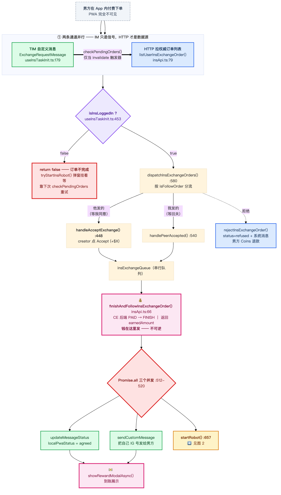
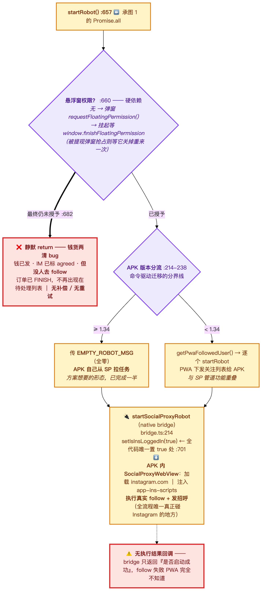
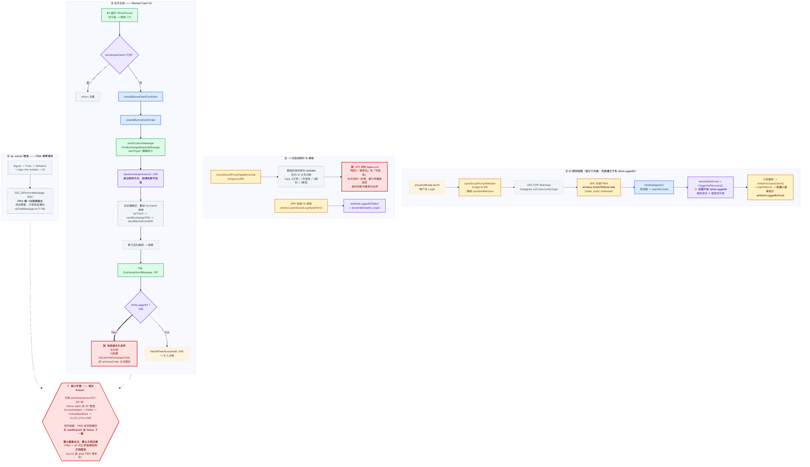
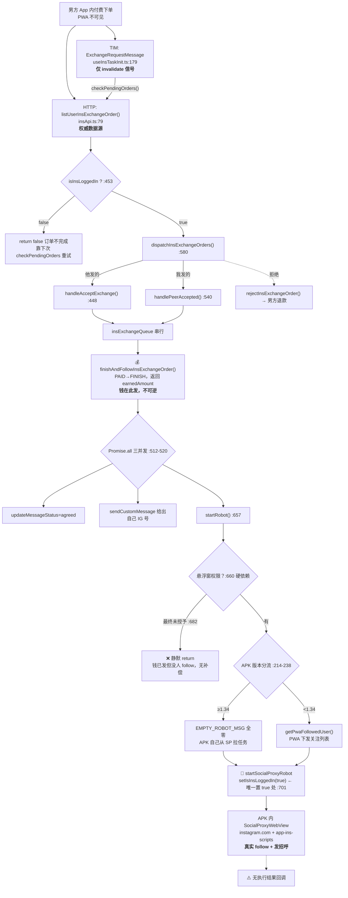
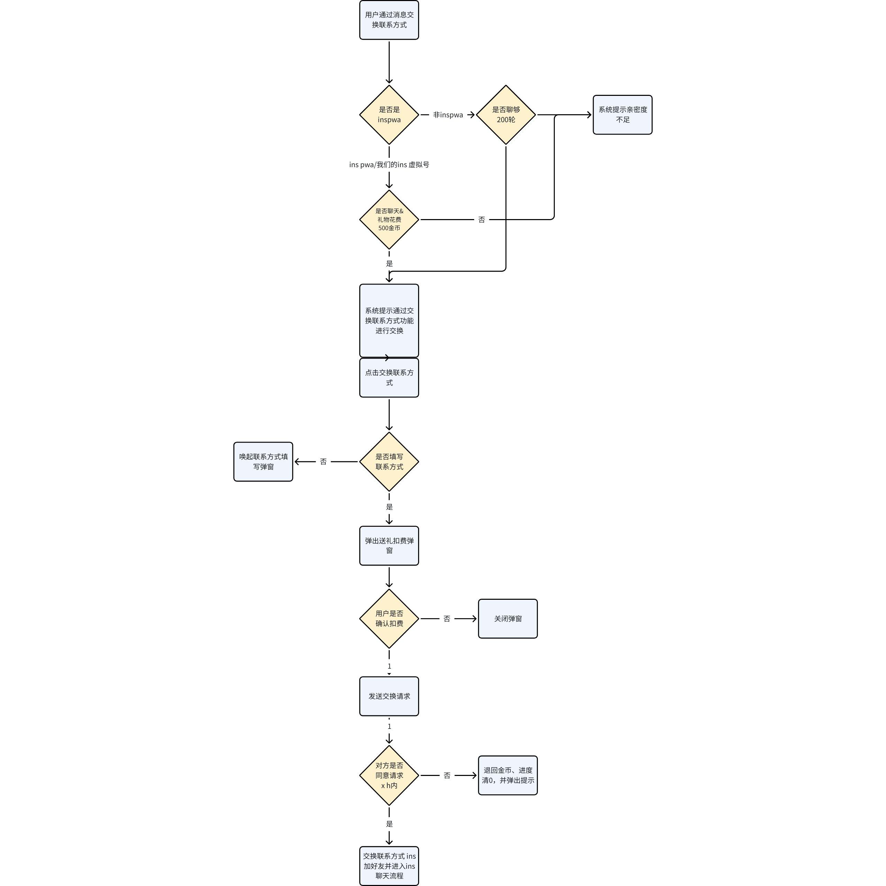
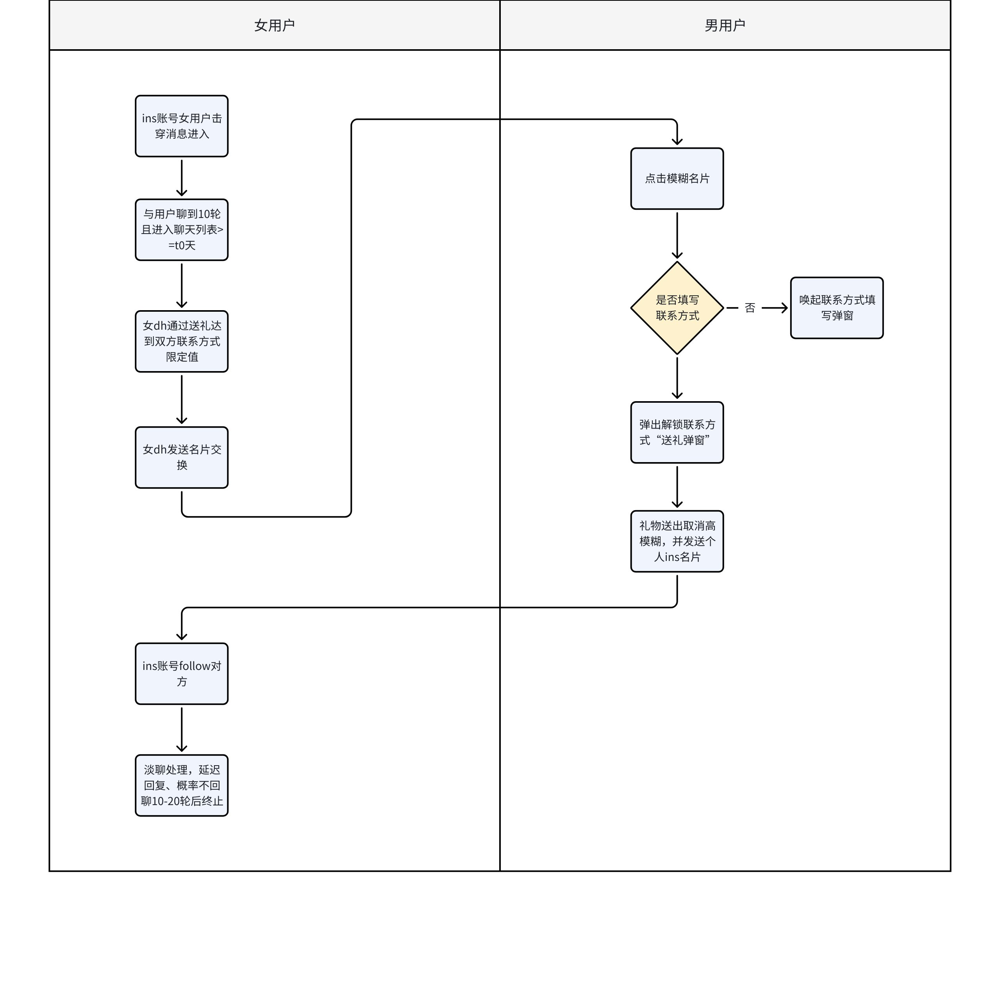

# CE 交换 INS 真实流程

> **口径**：本文的「流程」以 **`sitin-next/packages/app-pwa` 代码为准**（2026-07-16，`feature/sitin4.0`），逐行核实过。
> 需求文档只作对照，**已发现多处文档与代码、文档与文档互相矛盾**（见 §4）。
> 相关：[[social-proxy-scripts-container-app]]（测试工装，与线上无关）、[[android-webview-multi-social-memory]]（多社媒方案）

## 0. 一句话结论

**CE 请求不走 WS，也不走 sp-server。** PWA 侧几乎全程自驱：**HTTP(protobuf) 调 CE 后端 + TIM 自定义消息传递 + 通过 native bridge 拉起 APK 内的 INS 机器人 WebView 去完成真实 follow**。

**sp-server 管道（Signal → Todo → Behavior → app-ins-scripts）在 PWA 代码里零调用** —— PWA 不知道它存在，只通过 `S2C_AIPersonaMessage` WS 推送**间接感知它产生的收益**。这与 `docs/ce-sp/architecture.md` 的描述**实质冲突**（§4.3）。

⚠️ `network/ws/aiChatMessage.ts` **不是** CE 请求通道，它只负责 AI persona 消息收益推送。

## 1. 流程图





> 拆图的分界点选在 `Promise.all` —— 那正是「拿钱」与「干活」的分水岭，也是 §3.1 那个 bug 的所在：图 1 结束时钱已不可逆地发出，图 2 才去干活，而干活可能静默失败。



## 2. 涉及的动作清单

### HTTP → CE 后端（`http/insApi.ts`，全部 POST + protobuf）

| 函数 | 行 | 用途 |
|---|---|---|
| `finishAndFollowInsExchangeOrder` | 66 | **完成交换 + 发放奖励**（核心，钱在这发） |
| `listUserInsExchangeOrder` | 79 | 待处理订单列表（**权威数据源**） |
| `rejectInsExchangeOrder` | 88 | 拒绝 → 男方 Coins 退款 |
| `checkBlurredCardCondition` / `createBlurredCardOrder` | 137 / 165 | 女方主动 Blurred Card V2 |
| `sendBlurredCardGift` | 151 | 亲密度加成 |
| `getClientConfig` | 121 | 取 `ins_exchange_gift` 礼物配置 |
| `getPwaFollowedUser` | 102 | 已关注列表（**仅 APK < 1.34 老路径**） |
| ~~`getInsExchangeConditionInfo`~~ / ~~`initInsExchangeOrder`~~ / ~~`getPwaInsExchangeOrderReward`~~ | 48/57/112 | **死代码**，PWA 内无调用方 |

> `safePost` 包装（`insApi.ts:34-45`）失败静默返回 `null` → **网络错误与业务失败无法区分**。

### TIM IM 消息（`types/chatMessage.ts:66-71, 405-490`）

| CustomDescription | 方向 | 类 |
|---|---|---|
| `insExchangeRequest` / `freeExchangeRequest` | 男→女 或 女→男 | `ExchangeRequestMessage` |
| `insExchangeSend` / `freeExchangeSend` | 接受方回执（给出自己 IG 号） | `ExchangeSendMessage` |
| `freeExchangeSystem` | 系统（拒绝通知） | — |

**设计要点**：IM 消息**不是数据源，只是 invalidate 信号** —— 收到就去 `listUserInsExchangeOrder()` 拉权威列表。

`localPwaStatus` 落盘在 IM 消息体里实现跨端同步 + 防重复处理（`updateMessageStatus` :112-149）。有个**精妙但脆弱**的点（:144）：
```ts
// 直接改 payload.data 属性，不替换整个 payload 对象
// SDK 内部靠原始对象引用追踪变更，替换对象会导致变更不被检测
rawMessage.payload.data = JSON.stringify(nextPayload);
```

状态取值：Request 侧 `countdown → agreed | refused | expired`；Send 侧 `unfollowed → followed`。
⚠️ **`expired` 类型里定义了、`updateMessageStatus` 也支持，但代码中没有任何地方写入它**。

### Native bridge（`utils/bridge.ts`，全部带老版本降级）

| bridge 方法 | 行 | 降级 | 触发点 |
|---|---|---|---|
| `openSocialProxyWebview` | 166 | `openInsWebView` | `showInsModal.tsx:61` 用户点 Login |
| `startSocialProxyRobot` | 214 | `startInsRobot` | `useInsTaskInit.ts:693` |
| `isPermissionGranted("Floating")` | 236 | — | :660, :681 |
| `requestPermission("Floating")` | 248 | — | :663, :668 |
| `checkSocialProxyPageAbnormal` | 265 | `checkInsPageAbnormal` | :370 冷启动探针 |
| `getApkVersion` | 665 | — | :214 版本分流 |

**APK → PWA 反向回调**：`window.finishPWAInsTask(state, insId, insAvatar)`、`window.openSocialLogin(platform)`（IG 掉线）、`window.finishFloatingPermission()`（:674 **临时挂 window 上、用完 delete 的 ad-hoc 回调**，与其它 bridge 回调风格不一致）。

## 3. 五个真实问题（都是代码事实，非推测）

### 3.1 钱货两清 —— `useInsTaskInit.ts:512-520`
`finishAndFollowInsExchangeOrder`（**钱已发、不可逆**）与 `startRobot`（**可能静默失败**）在同一个 `Promise.all` 里。悬浮窗权限最终未授予 → `:682` 直接 `return`：**钱已发 · IM 已标 agreed · 但没人去 follow**。而订单已 FINISH，**不会再出现在待处理列表**，`checkPendingOrders` 也救不回来 —— **无补偿、无重试**。

### 3.2 无执行结果回调
`startSocialProxyRobotWebView` 只返回「**是否启动成功**」，没有执行结果回调。**机器人 follow 失败，PWA 完全不知道**。

### 3.3 消息永久丢弃 —— `:197-201`
`ExchangeSendMessage` 到达时若 `isInsLoggedIn === false`，**该消息被直接丢弃且无补偿**（只能靠 `listUserInsExchangeOrder` 的 `isFollowOrder` 分支救回）。

### 3.4 被封 == 未登录 —— `:371`
冷启动探针 `checkSocialProxyPageAbnormal` 用固定测试账号 **`leohalm`** 访问 IG 主页，返回 `type: 0正常 / 1未登录 / 2被封 / 3禁言`。但 `:371` **只判 `type === 0`** → 把「被封/被禁言」和「未登录」合并成同一处理，**都引导用户重新登录**。被封的账号重登也无济于事。

### 3.5 两个状态正交，容易误解
| 字段 | 含义 | 置 true 处 | 置 false 处 |
|---|---|---|---|
| `insState` | IG **账号已授权绑定** | `useInsBridgeCallbacks.ts:78` | 同处（失败，:96） |
| `isInsLoggedIn` | IG **会话可用 / 小崽跑起来了** | **仅** `useInsTaskInit.ts:701`（startRobot 成功后） | :373 冷启动异常、`useInsBridgeCallbacks.ts:107` APK 报掉线 |

**授权成功 ≠ 登录态可用。** 授权回调只设 `insState` + `triggerInsRecovery()`，要等机器人真跑起来才 `setIsInsLoggedIn(true)`。

## 4. 冲突清单

### 4.1 需求文档之间

真源：[交换联系方式 ins](https://presence.feishu.cn/wiki/MG40wk1xEiTFdKkc4L0cBv61nkf)、[PWA1.21.0](https://presence.feishu.cn/wiki/SHvbw1AWLiuWvTkNoeWcNconnrb)、[PWA1.25.0](https://presence.feishu.cn/wiki/CID0wIMLRir2UqkfVrDcqYF7n9k)

| | 文档1 交换联系方式 | 文档2 PWA1.21.0 |
|---|---|---|
| 男方门槛（对 inspwa） | 正文 **250 金币** / 画板 **500 金币** ⚠️自相矛盾 | — |
| 请求过期 | `x 小时内` | **5 分钟**（`Expires: 00:05:00`）+ 离线 24h 默认拒绝 |
| 发现 IG 新消息 | round + 冷却 [1,24]h | **每 30 秒轮询一遍** |

> 文档2 的「每 30 秒轮询」是**上一代设计**，已被 sp-server 的服务端 `inbox-poll.service.ts` + IG `startDMListener` 取代。

需求画板（存档）： 

### 4.2 `docs/ce-sp/pwa.md` 已过期 8 处

| # | 文档说 | 代码事实 |
|---|---|---|
| 1 | `useInsTaskInit` 有 `handleInsExchangeMessage` | ❌ 不存在。实际是 `handleAcceptExchange`(:448) / `dispatchInsExchangeOrders`(:580) |
| 2 | `insExchangeStore` 有 `pendingMessages`/`processedCount`/`followedUsers` 等 | ❌ **整个 store 只剩 `earnings`/`addEarnings`/`resetEarnings`** |
| 3 | 授权回调后 set `isInsLoggedIn = true` | ❌ 只设 `insState`（见 §3.5） |
| 4 | 未授权 → `showInsModal / showInsAuthPermissionModal` | ⚠️ 实际是 `tryStartInsRobot()`(:435-445) 内部再判断 |
| 5 | `InsExchangeModal` 是底部弹窗 | ❌ `variant: "center"` |
| 6 | — | ❌ **完全没提 APK 1.34 版本分流**（当前最重要的架构分界） |
| 7 | `insState` 是「授权中/已完成/失败」 | ❌ 是 `boolean` |
| 8 | HTTP API 表列了 `checkFreeExchangeCondition` 等 | ⚠️ 不在 `insApi.ts`；且表里三个函数是死代码 |

### 4.3 ⭐ 核心矛盾：谁去 follow？

`docs/ce-sp/architecture.md:137-152` 说：
> Phase 3 — PWA 端完成交换 → `CE → KAFKA: 发布 ce.exchanged`
> Phase 4 — SP 自动化回关 → `KAFKA → SP → FollowBackRule → CLICK_FOLLOW → app-ins-scripts → IG`

**文档把 follow-back 完全归给 SP 管道。但代码里 PWA 在 `finishAndFollowInsExchangeOrder` 之后自己又 `startRobot()` 去 follow 了一遍。**

两种可能：
- (a) 两条路径并存 → **重复关注**
- (b) APK ≥1.34 的 `EMPTY_ROBOT_MSG` 只是「唤醒小崽」、实际关注由 SP 下发 —— 从 `:219` 传空列表看 **(b) 更可能**

但**老版本分支（`:223-238`）确实是 PWA 下发关注列表**，与 SP 管道功能重叠。**这一层文档完全没有交代。**

> **`sp.md` 里 grep `PWA|finishPWAInsTask|startSocialProxyRobot` 零命中** —— PWA 与 SP 之间的边界**没有任何文档描述**，这正是上述矛盾无法从文档解决的原因。排查「重复关注 / 关注丢失」时这是第一个要澄清的点。

## 5. ⭐ APK 1.34 —— 命令驱动迁移的分界线

`useInsTaskInit.ts:214-238`：

```ts
const isNewVersion = !!apkVersion && compareVersions(apkVersion, "1.34") >= 0;
if (isNewVersion) { await startRobot(EMPTY_ROBOT_MSG, isFirstTime); return; }  // 空列表，APK 自己接管
const response = await getPwaFollowedUser();   // 老版本：PWA 把关注列表一个个喂给 APK
for (const u of response.followedUserinfo) { await startRobot({...}, isFirstTime); }
```

**新版 APK 的机器人已改为自己从 SP 拉任务，不再依赖 PWA 下发关注列表。** 这是「PWA 驱动 → SP 驱动」迁移的分界线，也意味着 [[android-webview-multi-social-memory]] 那套「命令驱动」**已经完成了一半**。但 PWA 代码里**两条路径仍并存**。

## 6. 关键文件

| 文件 | 角色 |
|---|---|
| `hooks/useInsTaskInit.ts` | **CE 总调度**（709 行），由 `useUserInit.ts:109` TIM 登录后启动 |
| `hooks/useInsBridgeCallbacks.ts` | APK→PWA 授权回调 |
| `utils/bridge.ts` | `:166-289` 全部 INS native 桥 |
| `http/insApi.ts` | 11 个 CE 接口 |
| `stores/insStore.ts` | `insState` / `isInsLoggedIn`（两者正交，都 persist） |
| `stores/insExchangeStore.ts` | **只剩 earnings** + `InsExchangePendingMessage` 类型 |
| `types/chatMessage.ts` | `:405-490` Exchange 消息类 |
| `pages/Chat/bubbles/InsExchangeBubble.tsx` | Accept/Reject UI |
| `components/InsExchangeModal.tsx` | 批量 Accept 弹窗 |
| `utils/insExchangeQueue.ts` | 串行队列 |

## 7. 方法论

- **画板是需求文档里信息密度最高的部分**，`docs +fetch` 只会返回 `<whiteboard token="...">` 标签。必须 `docs +media-download --token <t> --type whiteboard --output <相对路径>` 导出成图再读（画板**只能**走这个，不能用 `+media-preview`）。
- 流程图渲染：`npx @mermaid-js/mermaid-cli`，配 `-p puppeteer.json` 指系统 Chrome、`themeVariables.fontFamily` 指 `PingFang SC` 免中文方框。**一张 16 层深的图会渲成 1:3.2 的瘦长条，在飞书里等于没法看** —— 按语义拆图（本文拆点选在 `Promise.all`，即「拿钱/干活」分水岭）。
